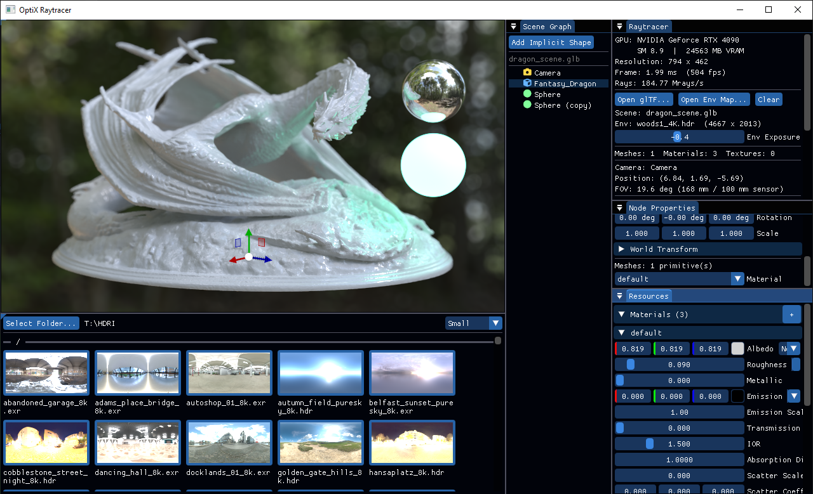

# OptiX Raytracer

A physically based GPU path tracer built on NVIDIA OptiX 9.x, CUDA, Vulkan, C++17, and Dear ImGui.



---

## Features

### Rendering
- **Monte Carlo path tracing** with up to 16 bounces and per-pixel progressive accumulation
- **PBR materials** (GGX-VNDF microfacet BRDF) — albedo, roughness, metallic, clearcoat, clearcoat roughness, emission, transmission, IOR, and absorption distance; sRGB albedo textures and colour values are linearised before lighting calculations
- **Probabilistic lobe selection** — clearcoat → specular → diffuse/refraction, each weighted by Fresnel probability for energy conservation; lobe selection uses the exact dielectric Fresnel equation (not Schlick) so IOR = 1 materials are correctly invisible at all angles
- **Stochastic refraction** — rough dielectric transmission with Snell's law and GGX microfacet normal sampling; Beer-Lambert volumetric absorption for coloured glass (absorption accumulates over distance, not at the surface); **nested dielectrics** — a per-path medium stack tracks the enclosing material IOR and absorption so overlapping or nested glass objects refract and attenuate correctly; **thin-walled glass** mode skips volume absorption and tints NEE shadow rays with the glass colour for correct single-surface light filtering
- **Environment lighting** — equirectangular EXR maps (`.exr`, all codecs: NONE / RLE / ZIP / PIZ / PXR24 / B44 / DWAA / DWAB) or Radiance HDR maps (`.hdr`) or procedural sky gradient, with rotation and exposure (EV) controls; NaN and inf pixels are clamped at load time (NaN → 0, inf → 65504) so over-bright sources never corrupt thumbnails or the CDF
- **HDRI importance sampling** — 2D luminance CDF built at load time; NEE fires shadow rays toward bright env-map regions at every diffuse and specular (GGX) bounce; MIS power heuristic with the GGX VNDF PDF prevents double-counting on specular escape paths
- **Emissive mesh / implicit NEE with MIS** — direct illumination from emissive surfaces is sampled at every diffuse and specular bounce; area-to-solid-angle Jacobian handles non-uniform scale correctly; MIS power heuristic combines emissive NEE, HDRI NEE, and BSDF strategies so emissive geometry integrates with the same noise-reducing efficiency as the environment map
- **Thin-lens depth of field** — focal length, sensor size, f-stop, focus distance, and adjustable bokeh edge bias
- **scRGB FP16 swapchain with automatic SDR fallback** — on Windows with HDR enabled, presents through `VK_FORMAT_R16G16B16A16_SFLOAT` + `VK_COLOR_SPACE_EXTENDED_SRGB_LINEAR_EXT`; on displays without HDR, automatically falls back to `VK_FORMAT_B8G8R8A8_UNORM` + `VK_COLOR_SPACE_SRGB_NONLINEAR_KHR` with Reinhard tone-mapping and gamma encoding; no configuration required
- **HDR output toggle** — available on HDR displays (scRGB swapchain active); when off, Reinhard tone-maps accumulated radiance into SDR range; when on, radiance passes through unclamped so highlights can exceed paper white; automatically disabled with a *(no HDR display)* label on SDR displays
- **OptiX AI denoiser** — normal + albedo guide layers, configurable denoise interval, keeps the last denoised frame while accumulating

### Scene
- **glTF 2.0 / GLB loading** — meshes, PBR materials (including `KHR_materials_transmission`, `KHR_materials_ior`, `KHR_materials_clearcoat`, `KHR_materials_emissive_strength`), base-colour textures, cameras, scene hierarchy; `baseColorFactor` and `emissiveFactor` are converted from the linear space mandated by the glTF spec to sRGB at import time, matching the internal `MaterialData` convention
- **Scene graph** — full glTF node hierarchy preserved as a `Node3D` tree (`MeshNode`, `CameraNode`, `GroupNode`, `ImplicitNode`)
- **Node transforms applied to TLAS** — mesh instances positioned using accumulated world-space transforms from the node hierarchy
- **Live transform editing** — 3D gizmo (ImGuizmo) overlaid on the viewport for interactive Translate / Rotate / Scale in Local or World space; raw matrix fields remain available for precise values; TLAS-only rebuild keeps BLASes intact
- **Analytic implicit shapes** — `ImplicitNode` renders Sphere, Box, or Cylinder via OptiX custom primitives (`OPTIX_BUILD_INPUT_TYPE_CUSTOM_PRIMITIVES`); shapes are canonical unit forms in local space so the node's TRS transform controls size and placement; all full PBR materials (including transmission and clearcoat) apply identically to implicit shapes and mesh geometry

### Camera
- **Free-fly camera** — WASD (move), EQ (up/down), right-drag (look), Ctrl+drag (orbit), Shift+drag (rotate environment)
- **Smart orbit pivot** — Ctrl+RMB orbits around a persistent world-space pivot updated by every relevant action: left-click selection sets it to the selected node's origin; middle-click sets it to the exact 3D surface hit under the cursor; falls back to the camera focus point when nothing is selected
- **Middle-click focus** — shoots an OptiX pick ray and sets the camera focus distance to the hit depth and the orbit pivot to the 3D hit point in one gesture
- **Physical camera parameters** — focal length (mm), sensor size (mm), f-stop, and focus distance drive the FOV and depth of field
- **glTF camera import** — imported yFov converted to focal length at load time

### UI (Dear ImGui with docking)
| Panel | Contents |
|---|---|
| **Viewport** | Live rendered image, resizes dynamically; left-click to select scene nodes via OptiX pick ray |
| **Raytracer** | GPU stats, sample count, denoiser toggle, environment controls, HDR output toggle, paper-white slider (active when Windows HDR is on) |
| **Resources** | Collapsible sub-categories: **Materials** (per-material PBR editor with albedo swatch preview) and **Textures** (loaded scene textures with dimensions and format) |
| **Scene Graph** | Hierarchy tree of all scene nodes with per-type **FontAwesome icons** (mesh=blue cube, camera=gold camera, implicit=green circle/square/database, group=gray layer-group); click to select, right-click for **Duplicate** / **Delete**; drag to reorder or reparent nodes; **Add Implicit Shape** button creates a Sphere, Box, or Cylinder node at the world origin |
| **Node Properties** | Gizmo operation / space selector, TRS sliders, read-only **World Transform** display (accumulated parent-to-world matrix), material editor, camera parameters for the selected node; implicit shape nodes additionally show a shape-type selector (Sphere / Box / Cylinder) and a material combo |
| **HDRI Browser** | Async thumbnail grid for quick environment switching — select a folder (scanned recursively); **folder-grouped layout** with section headers (bare filename shown, full relative path in tooltip); **persistent disk cache** (~256 KB/entry at `{exe}/thumbnails/`, FNV-1a hash + mtime/size validation, write-then-rename for crash safety) skips the full HDR decode on warm loads; root-folder files prioritised in the load queue; thumbnails generated on 16 background threads — box-filter downsample + log-average auto-exposure → **linear RGBA16F** (no tone-mapping; highlights above 1.0 are preserved and appear above paper-white on HDR monitors); animated arc spinner while loading; size selector (Large / Medium / Small); active map highlighted; supports non-ASCII paths (ä/ö/å etc.) |

### Performance
- **PTX hot-reload** — edit `device_programs.cu`, rebuild the PTX, and the shader reloads without restarting; accumulation resets automatically
- **BLAS compaction** — per-mesh bottom-level AS built with size compaction
- **Frame-time EMA** — smoothed frame time and Mrays/s display

---

## Prerequisites

| Requirement | Version | Notes |
|---|---|---|
| NVIDIA GPU | Compute capability ≥ 7.5 | RTX 20xx / 30xx / 40xx |
| NVIDIA Driver | ≥ 570.x | Required by OptiX 9.1 |
| [NVIDIA OptiX SDK](https://developer.nvidia.com/optix) | 9.1.0 | Free download; requires NVIDIA developer account |
| [CUDA Toolkit](https://developer.nvidia.com/cuda-downloads) | 12.x or 13.x | Installs `nvcc` and CUDA runtime |
| [Vulkan SDK](https://vulkan.lunarg.com/) | ≥ 1.3 | Installs headers, loader, and validation layers |
| **Windows:** [Visual Studio 2022](https://visualstudio.microsoft.com/) | 17.x | With **Desktop development with C++** and **CUDA** workloads |
| **Linux:** GCC | ≤ 15 | CUDA 13.x does not support GCC 16+; install `gcc15`/`g++15` alongside the system compiler |
| [CMake](https://cmake.org/download/) | ≥ 3.20 | Add to PATH during install |
| **Linux:** Ninja *(optional)* | any | Used automatically if present; falls back to Unix Makefiles |

> **Driver check**: Run `nvidia-smi`. The driver version appears top-right. If below 570, download the latest from [nvidia.com/drivers](https://www.nvidia.com/drivers).

> **Vulkan check**: Run `vulkaninfo`. If absent, install Vulkan headers and the loader — on Arch: `sudo pacman -S vulkan-icd-loader vulkan-headers`; ensure `VULKAN_SDK` is set if using the LunarG SDK tarball.

---

## Building

### Linux (Arch / other distros)

`build.sh` in the repository root handles configure and build in one step. It automatically selects `g++-15` as the compiler when available (required for CUDA 13.x compatibility) and picks Ninja if installed.

```bash
# First time: add CUDA to PATH
echo 'export PATH="/opt/cuda/bin:$PATH"' >> ~/.bashrc
echo 'export LD_LIBRARY_PATH="/opt/cuda/lib64:$LD_LIBRARY_PATH"' >> ~/.bashrc
source ~/.bashrc

# Build (Release by default)
./build.sh

# Debug build
./build.sh Debug

# Force a clean reconfigure (required when changing compiler or generator)
./build.sh --clean

# If OptiX is not auto-detected:
./build.sh -DOptiX_INSTALL_DIR=~/NVIDIA-OptiX-SDK-9.1.0
# or: export OptiX_INSTALL_DIR=~/NVIDIA-OptiX-SDK-9.1.0
```

On first run, CMake fetches GLFW, ImGui, ImGuizmo, tinygltf, Imath, OpenEXR, nativefiledialog-extended, and the **FontAwesome 6 Free Solid** font (`fa-solid-900.ttf`) from GitHub — internet access is required. The font is downloaded once into `fonts/` (gitignored) and copied next to the executable at build time.

**Run:**
```bash
./build/bin/Release/OptixRaytracer
```

---

### Windows

Two batch scripts are provided in the repository root:

| Script | Purpose |
|---|---|
| `configure.bat` | Generate (or refresh) the Visual Studio solution |
| `build.bat` | Configure if needed, then compile |

**Command line:**

```bat
build.bat          :: Debug build (configures automatically on first run)
build.bat Release  :: Release build
```

**Visual Studio:**

```bat
configure.bat          :: Generate build\OptixRaytracer.sln
configure.bat --clean  :: Wipe CMake cache first, then regenerate
```

Open `build\OptixRaytracer.sln`. **OptixRaytracer** is the startup project — press **F5** to run. Re-run `configure.bat` after adding/removing source files or changing `CMakeLists.txt`.

**Manual CMake:**

```powershell
cmake -S . -B build -G "Visual Studio 17 2022" -A x64

# If OptiX is not detected automatically:
cmake -S . -B build -G "Visual Studio 17 2022" -A x64 `
    -DOptiX_INSTALL_DIR="C:/ProgramData/NVIDIA Corporation/OptiX SDK 9.1.0"

cmake --build build --config Debug   --parallel
cmake --build build --config Release --parallel
```

**Run:**

```powershell
.\build\bin\Debug\OptixRaytracer.exe
```

---

## Controls

| Input | Action |
|---|---|
| **RMB drag** | Free-look (rotate camera orientation) |
| **Ctrl + RMB drag** | Orbit camera around the current pivot (set by node selection or middle-click) |
| **Shift + RMB drag** | Rotate environment map azimuthally |
| **W / S** | Move forward / backward |
| **A / D** | Strafe left / right |
| **E / Q** | Move up / down |
| **Left-click in Viewport** | Select the clicked scene node via OptiX pick ray; sets orbit pivot to node origin; click empty space to deselect |
| **Middle-click in Viewport** | Set camera focus distance to the clicked surface depth; sets orbit pivot to the 3D hit point |
| **Click node in Scene Graph** | Select node; 3D gizmo appears in Viewport |
| **Drag gizmo handle** | Translate / rotate / scale the selected node |
| **Translate / Rotate / Scale buttons** | Switch gizmo operation (Node Properties panel) |
| **1 / 2 / 3** | Keyboard shortcut: Scale / Rotate / Translate |
| **Local / World buttons** | Switch gizmo reference space (Node Properties panel) |
| **Open glTF…** | Browse for `.gltf` or `.glb` scene file |
| **Open Env Map…** | Browse for an equirectangular environment map (`.exr` or `.hdr`) |
| **Clear** | Remove the environment map (falls back to procedural sky) |
| **HDRI Browser → Select Folder…** | Pick a folder; all `.exr` and `.hdr` files found recursively are shown as thumbnails |
| **HDRI Browser → thumbnail click** | Load the clicked file as the environment map |
| **HDRI Browser → size combo** | Switch thumbnail display size: Large / Medium / Small |

---

## Project Structure

```
Optix-Raytracer/
├── CMakeLists.txt                  Root build: project settings, FetchContent, subdirs
├── build.sh                        Linux build script (configure + compile)
├── build.bat / configure.bat       Windows build scripts
├── imgui.ini                       Versioned default Dear ImGui window layout
├── app.PNG                         Application screenshot
├── fonts/                          Downloaded at configure time (gitignored): fa-solid-900.ttf
├── cmake/
│   ├── FindOptiX.cmake             Locates the OptiX SDK; creates the OptiX::OptiX target
│   ├── cuda_intellisense.props.in  VS property sheet: adds OptiX to IntelliSense
│   └── InstallDefaultIni.cmake     Install imgui.ini next to the exe on first build
├── shaders/
│   ├── device_math.h               float3 operator overloads (+ − * / for device and host)
│   ├── launch_params.h             GPU parameter struct shared between host and device
│   ├── scene_data.h                MeshData and MaterialData (no STL; host + device)
│   ├── device_programs.cu          OptiX device programs — iterative path tracer,
│   │                               HDRI importance sampling, NEE shadow rays, MIS
│   ├── ui_scrgb.vert / .frag       Custom ImGui GLSL shaders: sRGB→linear + paper-white scale
│   ├── ui_scrgb_spv.h              SPIR-V bytecode (generated — do not edit by hand)
│   └── regen_ui_spv.ps1            PowerShell script to recompile the UI shaders via glslc
└── src/
    ├── main.cpp                    Entry point
    ├── application.h/.cpp          App init, viewport panel, scene loading, per-frame render loop
    ├── application_pipeline.cpp    OptiX pipeline, program groups, SBT, and 1px pick launch
    ├── application_camera.cpp      Free-fly camera controller and camera-node sync
    ├── cuda_optix_check.h          CUDA_CHECK / OPTIX_CHECK error macros (shared across TUs)
    ├── ui_raytracer_panel.cpp      Raytracer panel: GPU stats, scene/env controls, denoiser, HDR
    ├── ui_resources_panel.cpp      Resources panel: full PBR material editor, texture list
    ├── ui_scene_graph_panel.cpp    Scene Graph panel: node hierarchy tree, Add Implicit Shape
    ├── ui_node_properties_panel.cpp Node Properties panel: TRS editor, per-type settings
    ├── gpu_buffer.h                RAII CUDA device allocation (GPUBuffer): alloc / free /
    │                               upload / download / clear; non-copyable, movable
    ├── vulkan_context.h/.cpp       Vulkan device, swapchain, render pass, display image,
    │                               and per-frame present logic
    ├── hdri_browser.h/.cpp         Async HDRI/EXR thumbnail browser panel — worker thread
    │                               pool (16 threads), folder-grouped layout, persistent disk
    │                               cache (FNV-1a hash + mtime/size validation), root-first
    │                               load order, log-average auto-exposure, box-filter downsample
    │                               → linear RGBA16F (no tone-mapping; HDR highlights preserved),
    │                               recursive folder scan
    ├── icons.h                     FontAwesome 6 glyph macros (ICON_FA_*) for scene-graph icons
    ├── matrix4x4.h                 Row-major Matrix4x4 with multiply, inverse, and
    │                               column-major converters for ImGuizmo interop
    ├── camera.h                    Camera struct: transform, FOV, DoF parameters
    ├── node_3d.h                   Node3D base + MeshNode, CameraNode, GroupNode; each node carries a cached worldTransform (maintained by Scene)
    ├── implicit_node.h             ImplicitNode (Sphere / Box / Cylinder) with shape type enum and material index
    ├── scene.h/.cpp                Scene container: meshes, materials, textures, node tree; updateWorldTransforms / updateAllWorldTransforms keep cached world matrices in sync; deleteSubtree removes a node and its descendants
    ├── mesh.h                      Host-side mesh: separate vertex attribute arrays
    ├── texture.h/.cpp              RAII GPU texture: RGBA8 / RGBA32F; EXR loading via
    │                               OpenEXR (all codecs), HDR loading via stb_image,
    │                               NaN/inf pixel sanitisation at load time, GPU upload,
    │                               HDRI importance-sampling CDF; UTF-8 path support on
    │                               Windows (_wfopen / WideFileStream)
    ├── accel.h/.cpp                OptiX acceleration structure: BLAS per mesh + TLAS
    ├── scene_loader.h/.cpp         glTF 2.0 loader (tinygltf); populates Scene from file
    └── CMakeLists.txt              Executable target, include paths, link libraries
```

---

## Troubleshooting

**`OptiX SDK not found`**  
Pass `-DOptiX_INSTALL_DIR=...` to the CMake configure command, or set the environment variable `OptiX_INSTALL_DIR`.  
- Windows default: `C:/ProgramData/NVIDIA Corporation/OptiX SDK <version>`  
- Linux: `~/NVIDIA-OptiX-SDK-<version>`

**`optixInit() failed` or crash on startup**  
Your NVIDIA driver is too old. Update to ≥ 570.x from [nvidia.com/drivers](https://www.nvidia.com/drivers).

**`nvcc` not found during configure (Linux)**  
CUDA Toolkit is not on PATH. Add `/opt/cuda/bin` to `PATH` in `~/.bashrc` (see build instructions above).

**`nvcc` not found during configure (Windows)**  
CUDA Toolkit is not on PATH. Reinstall CUDA Toolkit and ensure it is added to PATH, or open the project from a **Visual Studio Developer Command Prompt**.

**`CUDA : error : Cannot find compiler 'cl.exe'`** *(Windows)*  
Visual Studio C++ workload is missing. Open the VS Installer, modify the 2022 installation, and add **Desktop development with C++**.

**`fatal error: math.h: No such file or directory` or similar STL errors (Linux)**  
GCC 16+ is not supported by CUDA 13.x. Install `gcc15`/`g++15` — on Arch: `sudo pacman -S gcc15`. `build.sh` selects it automatically when present.

**`Vulkan SDK not found` during configure (Linux)**  
Install Vulkan headers and the ICD loader: `sudo pacman -S vulkan-icd-loader vulkan-headers` (Arch), then re-run `./build.sh --clean`.

**`Vulkan SDK not found` during configure (Windows)**  
Install the [Vulkan SDK](https://vulkan.lunarg.com/) and ensure the `VULKAN_SDK` environment variable is set (the installer does this automatically). Re-run `configure.bat` after installation.

**HDR Output checkbox is greyed out**  
The scRGB swapchain was not selected — either Windows HDR is disabled for the active display, or the GPU driver does not expose `VK_COLOR_SPACE_EXTENDED_SRGB_LINEAR_EXT`. Enable HDR in **Windows Settings → System → Display → HDR** and restart the app. The renderer falls back to BGRA8 + SDR tone-mapping automatically; no action is needed if HDR is not required.

**Black Viewport on startup**  
The Vulkan validation layer may be printing errors to stderr. Run from a terminal to see them. Common causes: outdated driver (update to ≥ 570.x) or missing Vulkan instance extensions from GLFW.

**Image is very dark or very bright**  
Adjust the **Env Exposure** slider in the Raytracer panel. For scenes with emissive materials adjust the emissive scale on the material.

**Scene with glass converges slowly despite HDRI**  
HDRI NEE fires only on diffuse bounces. Paths that escape through glass (transmission) follow the BSDF and are unaffected by NEE — this is correct behaviour. Increase `MAX_BOUNCES` in `device_programs.cu` if light needs more bounces to exit the glass.

**Depth of field has no visible effect**  
Ensure f-stop is low (try f/2 or f/1.4) and that objects in the scene are at a different distance from the **Focus Distance** setting in the Node Properties camera panel.

---

## License

GNU General Public License v3 — see [LICENSE](LICENSE).
